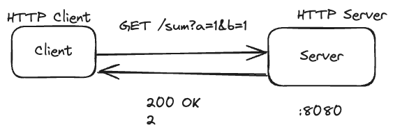

# level4

This is a simple attempt to build an HTTP server that serves: `sum(a, b)`.



This also provides samples on testing:

1. Simple functions
1. HTTP handlers
1. HTTP routing

## Running locally

```console
go test ./...
```
